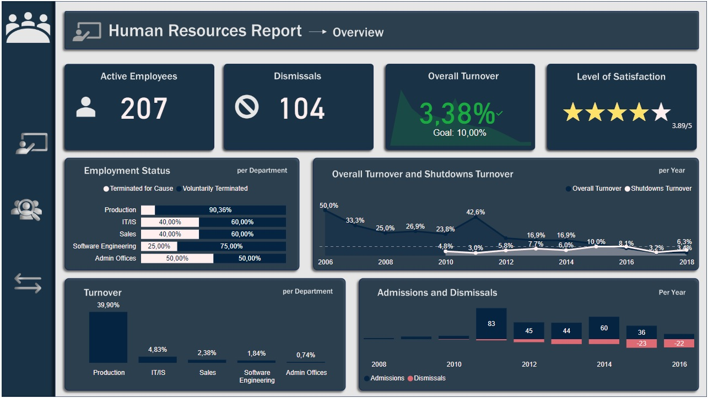

# Análise de Recursos Humanos com Power BI

## Visão Geral do Projeto

Este projeto focou em utilizar ferramentas de visualização de dados para obter descobertas e insights de uma empresa fictícia, a fim de ajudar o setor de recursos humanos a entender o perfil da empresa e de seus funcionários, assim como fazer recomendações de onde e em que aspecto poderiam focar para melhorar sua performance com people analytics.

## Relatório

[https://app.powerbi.com/view](https://app.powerbi.com/view?r=eyJrIjoiYzMyNDg3MzMtMTg4YS00ZmIwLTk2MTAtZjI3OWI5NWVkZjk1IiwidCI6IjAxZDZiZjY2LTE5MGItNGRhMC05OTRmLWIyNDg4MmZhYTA5NSJ9)

## Índice

- [Objetivo](#Objetivo)
- [Fonte de Dados](#Fonte-de-dados)
- [Etapas](#Etapas)
- [Procedimentos](#Procedimentos)
  - [Pesquisa](#Pesquisa)
  - [Ferramentas](#Ferramentas)
  - [Design](#Design)
  - [Análise](#Análise)
- [Visualização](#Visualização)
- [Medidas DAX](#Medidas-DAX)
- [Insights](#Insights)
- [Recomendações](#Recomendações)

## Objetivo

- Acompanhar KPIs do setor de Recursos Humanos.
- Analisar dados de igualdade de gênero através de diferentes departamentos.
- Visualizar informações sobre contratações e demissões da empresa.

## Fonte de Dados
- Nome: “Human Resources Data set”
- Fonte: Plataforma Kaggle.
    - [Human Resources Data set](https://www.kaggle.com/datasets/rhuebner/human-resources-data-set/data)
- O dataset contém 311 entradas e 36 colunas. 

## Etapas
- Pesquisa
- Ferramentas
- Design
- Análise

## Procedimentos

### Pesquisa
Primeiramente realizei uma pesquisa para entender quais são os principais KPIs a serem acompanhados em um setor de Recursos Humanos de uma empresa, chegando à conclusão que, para a finalidade de alcançar o objetivo, precisaria aprofundar em tópicos como: 
- Funcionários ativos
- Rescisões
- Turnover
- Taxa de absenteísmo
- Nível de satisfação e de engajamento de funcionários
- Diversidade e Inclusão
- Folha de pagamento

### Ferramentas

| Ferramenta | Propósito |
| --- | --- |
| Trello | Planejar as visualizações dos KPIs e organizar dados de medidas criadas |
| Mokkup AI | Estruturar e fazer o design do dashboard |
| Power Point | Estilizar e dar forma aos fundos de tela do relatório |
| Power Query | Explorar, limpar e analisar os dados |
| Power BI | Visualizar interativamente os dados e acompanhar os KPIs |
| Github | Documentar e versionar a análise |

### Design
Desenvolvi um esboço para estipular os visuais e quais seriam os dados necessários para buscar no dataset. Constituiu-se de 3 listas representando os objetivos e cartões representando os tipos de visuais, contendo as medidas que seriam necessárias para o visual.


Montei um modelo de como estruturar as páginas do relatório, contendo alguns dos visuais que melhor descreveriam as informações que precisaria demonstrar.


Modelei a imagem de fundo do relatório, para deixar definido os espaçamentos, títulos, subtítulos e páginas que receberiam os visuais.


### Análise

A abordagem geral do desenvolvimento deste projeto consistiu em: 

1. Extrair os dados diretamente no Power Query
2. Através do Power BI Desktop, importar os dados diretamente pela opção de obter dados de arquivo de texto/csv retirado da plataforma Kaggle.
3. Limpar os dados
4. Remover duplicidade de dados, analisar dados faltando e se faria sentido retirá-los ou tratá-los para o contexto da análise, verificar se haviam anomalias e removê-las.
5. Transformar os dados
6. Certificar da consistência dos dados; Remover colunas que não agregariam na análise; Formatar datas de local diferente da região; Editar colunas que fariam mais sentido para o contexto da análise, como idade e salário por mês; Criar colunas novas que proveriam mais informações relevantes para realizar as medidas e ajudar nas visualizações como tempo de serviço e faixa etária.
7. Estruturar as tabelas necessárias
8. Separar o dataset com dados de contratações e rescisões, para melhor visualizar as distribuições
9. Criar os relacionamentos entre as tabelas
10. Definir os relacionamentos entre as tabelas de contratações, rescisões e calendário.
11. Visualizar os dados com o Power BI
12. Criar os visuais com base no planejamento do Trello e do Mokkup AI, realizando as mudanças que julgava necessárias para melhor representar os dados e acompanhar os KPIs com mais clareza.

## Visualização



## Medidas DAX
#### 1. % absenteismoGeral
```
% absenteismoGeral =
    CALCULATE(
        (
            COUNT(dContratacoes[EmpID])
            \*
            SUM(dContratacoes[Absences]) * 8
        )
        /
        (
            COUNT(dContratacoes[EmpID])
            \*
            NETWORKDAYS(DATE(YEAR(MIN(dContratacoes[DateofHire])), "1", "1"), DATE(YEAR(MAX(dContratacoes[DateofHire])), "12", "31")) * 8 * 100
        ),
        dContratacoes[EmploymentStatus] = "Active"
    ) + 0

```

#### 2. # admissoes
```
# admissoes = COUNTROWS(
    dContratacoes
)

```

#### 3. # desligamentos
```
# desligamentos =
    COUNTROWS(
            dDesligamentos
    )

```

#### 4. # desligamentosValorNegativo
```
# desligamentosValorNegativo = [# desligamentos] * -1

```

#### 5. # funcionariosAtivos
```
# funcionariosAtivos =
    CALCULATE(
        COUNT(
            dContratacoes[EmploymentStatus]
        ),
        dContratacoes[EmploymentStatus]="Active"
    )

```

#### 6. # funcionariosAtivosGeral
```
# funcionariosAtivosGeral =
VAR admissoesAcumulado = CALCULATE(
    [# admissoes],
    FILTER(
        ALL(
            dContratacoes
        ),
        [DateofHire] <= MAX(
            dContratacoes[DateofHire]
        )
    )
)
VAR desligamentosAcumulado = CALCULATE(
    [# desligamentos],
    FILTER(
        ALL(
            dDesligamentos
        ),
        [DateofTermination] <= MAX(
            dDesligamentos[DateofTermination]
        )
    )
)
RETURN
AdmissoesAcumulado - DesligamentosAcumulado

```

#### 7. ~ salarioFuncionariosAtivos
```
~ salarioFuncionariosAtivos =
    CALCULATE(
        AVERAGE(dContratacoes[SalaryperMonth]),
        dContratacoes[EmploymentStatus] = "Active"
    )

```

#### 8. ~ engajamento
```
~ engajamento =
    CALCULATE(
        AVERAGE(
            dContratacoes[EngagementSurvey]
        ),
        dContratacoes[EmploymentStatus] = "Active"
    )

```

#### 9. ~ satisfacao
```
~ satisfacao = CALCULATE(
    AVERAGE(
        dContratacoes[EmpSatisfaction]
    ),
    dContratacoes[EmploymentStatus] = "Active"
)

```

#### 10. % turnoverDesligamentos
```
% turnoverDesligamentos = DIVIDE(
    [# desligamentos],
    [# funcionariosAtivosGeral]
)

```

#### 11. % turnoverGeral
```
% turnoverGeral = DIVIDE(
    ([# admissoes] + [# desligamentos]) / 2,
    [# funcionariosAtivosGeral]
)

```

## Insights 
- O Turnover Geral da empresa está dentro do proposto de 10%, e, associada com uma baixa taxa de rotatividade, e com uma média de satisfação de 77,8% (representado pela média de 3,89/5) indica que a empresa está no caminho certo de manter seus talentos satisfeitos, além de uma baixa taxa de absenteísmo (0,60%) com relação ao objetivo (5%). Pode-se perceber também que o setor de produção tem um índice de rescisão voluntária 9 vezes maior que a involuntária, indicando que é um dos setores que mais precisa de intervenção.

- Mesmo tendo mais funcionários do sexo feminino na empresa (56%), a média salarial está basicamente igualada entre homem e mulher, tendo mais funcionárias (7) do que funcionários (4) sêniores, com mais de 60 anos. As mulheres também lideram no quesito tempo de serviço em quase todas faixas etárias com exceção na de 0 a 2 anos de empresa, o que se relaciona com os níveis maiores de satisfação e engajamento pela parte feminina. Apenas em dois setores (TI e Vendas) os homens superam, ainda que por pouco, em quantidade, tendo também uma mulher como CEO da empresa.

- A maior plataforma de recrutamento da empresa é o site 'Indeed' (87 contratações), seguido pelo LinkedIn (76 contratações) e pelo Google Search (49 contratações). O maior número de desligamentos vem do setor de produção, sendo o setor de maior rotatividade de funcionários de ambos os sexos. A predominância de funcionários é branca, tendo 78 pessoas a mais que as raças ‘preto’ (80 funcionários) e ‘amarelo’ (29 funcionários) juntos.

## Recomendações
- Minimizar os efeitos de desligamentos no setor de produção através de:
  - Montagem de organograma, para deixar claro a visualização da hierarquia dos cargos e explicitar as possibilidades de crescimento interno.
  - Tornar o ambiente de trabalho mais amigável, para que o colaborador tenha mais motivação e uma maior qualidade de vida.
  - Traçar um perfil de cada líder do setor, para que se busque uma melhor preparação para lidar com os diferentes tipos de perfis de liderados, e para solucionar pendências surgidas ao longo dos processos de trabalho.
